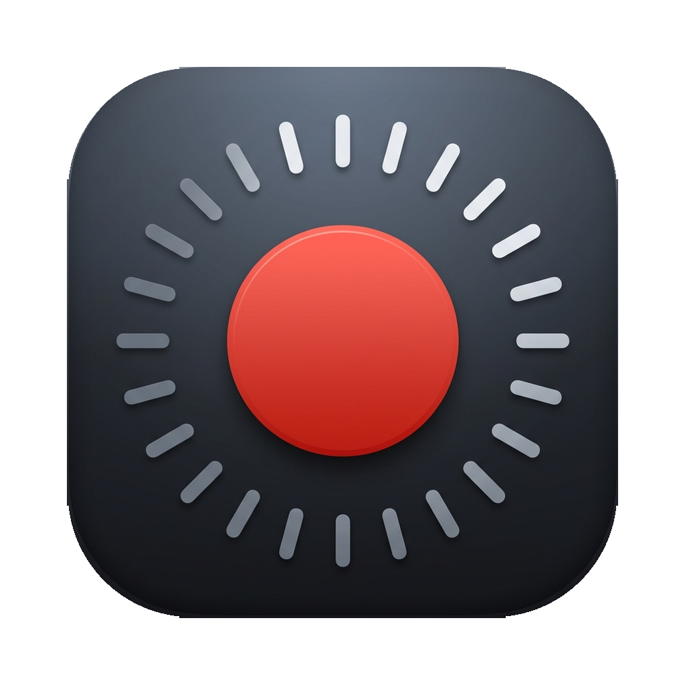
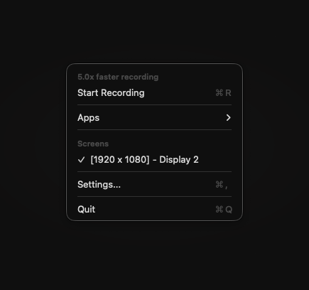
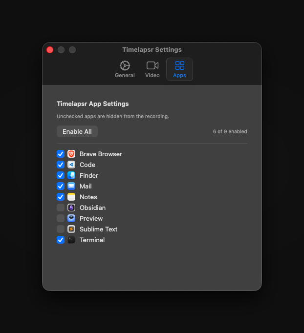
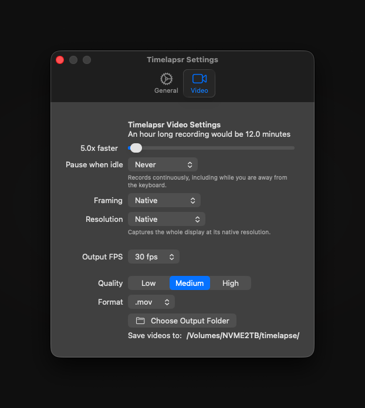

<p align="center"></p>

<h1 align="center">Timelapsr</h1>

<p align="center">
  <strong>Screen timelapses for macOS, without the file sizes.</strong>
</p>

<p align="center">
  A menu bar app that records your screen at a fraction of real time, so a six-hour
  build session becomes a few watchable minutes instead of six hours of video.
</p>

<p align="center">
  
  
  
</p>

---

<p align="center">
  
  &nbsp;&nbsp;
  
</p>

<p align="center">
  
</p>

## Why this fork exists

Timelapsr is a fork of [wkaisertexas/ScreenTimeLapse](https://github.com/wkaisertexas/ScreenTimeLapse)
(TimeLapze), an excellent open-source menu bar timelapse recorder.

The fork started as a bug hunt. Every recording came out unplayable, and tracking down
why turned up two independent defects plus a latent third. Those fixes, along with idle
detection and crash resilience, are what this fork adds.

### The bug that started it

Every recording produced a file with `ftyp` and `mdat` atoms but **no `moov` atom** —
video data present, index missing, nothing able to play it.

The cause was a single unset preference:

```swift
// PreferencesViewModel declares a default...
@AppStorage("timeMultiple") var timeMultiple: Double = 5.0

// ...but @AppStorage defaults only seed the SwiftUI binding. Nothing is written to
// UserDefaults until the user actually moves the control. The capture path reads
// the store directly:
timeMultiple = UserDefaults.standard.double(forKey: "timeMultiple")   // → 0 when unset

// ...and 0 reaches the frame timing math as:
tmpFrameBuffer?.offsettingTiming(by: offset, multiplier: 1.0 / timeMultiple)   // → ∞
```

An infinite multiplier poisons every presentation timestamp, `input.append()` fails, the
`AVAssetWriter` moves to `.failed`, and a failed writer silently skips writing the `moov`
atom.

The Preferences window displayed **"5x"** the whole time. The recorder was receiving
**0**. It hit every user who recorded before opening Preferences, and stayed invisible
to anyone who had ever touched the speed slider.

## What's different from upstream

| | |
|---|---|
| **Recordings actually play** | Real defaults registered at launch, plus guards so a zero or negative multiplier can never reach the timing math |
| **No frames lost on stop** | `stopCapture()` is awaited and late buffers are dropped, instead of racing `markAsFinished()` and failing the writer |
| **Interrupted sessions survive** | Stream-level failures (display sleep, a disconnected display, macOS tearing down the capture) now finalize the file, turning total loss into a truncated but valid recording |
| **Stream failures get reported** | `SCStream` holds its delegate weakly; the delegate is now retained rather than deallocated immediately after creation |
| **Pause when idle** | Capture stops after a configurable period without input, so breaks do not become dead air |

## Install

Requires macOS 14 or later.

```bash
git clone https://github.com/lovepixel-git/timelapsr.git
cd timelapsr
open Timelapsr.xcodeproj
```

Build and run from Xcode. Building locally signs the app with your own identity, which
avoids the Gatekeeper warnings that come with unsigned downloads.

Grant **Screen Recording** permission in System Settings → Privacy & Security when
prompted. Without it macOS silently hands back desktop wallpaper with no windows.

## Usage

Click the menu bar icon to start and stop. Recordings land in the folder set under
Preferences → Save Location.

Settings worth knowing:

- **Speed** — how much faster than real time. At 10x, an hour of work becomes six
  minutes. Lower values capture more frames, which keeps the option to speed up further
  later. You cannot recover frames you never captured.
- **Pause when idle** — stop capturing after N seconds without keyboard or mouse input.
  Defaults to Never.
- **Framing** — centre-crop to 16:9, 4:3, 1:1, or 9:16, for vertical or square cuts
  without a separate post pass.
- **Resolution** — cap the output long edge at 4K, 1440p, 1080p, or 720p. The single
  largest lever on file size.

### Known limitations

Inherited from upstream, documented rather than hidden:

- **The Output FPS and Quality pickers do nothing.** Both write to `UserDefaults` keys
  that the capture path never reads, and frame decimation is hardcoded to 1/30. Use
  **Speed** instead.
- **Idle pause and the finalization fixes are screen-only.** The camera recorder still
  has the un-awaited `finishWriting` and blocking `sleep(1)` that were fixed on the
  screen path.

## Building from the command line

```bash
xcodebuild build -project Timelapsr.xcodeproj -scheme Timelapsr -destination 'platform=macOS'
xcodebuild test  -project Timelapsr.xcodeproj -scheme Test      -destination 'platform=macOS'
```

## How it works

SwiftUI, ScreenCaptureKit, and AVFoundation. `SCStream` delivers frames to an
`AVAssetWriter`, and frames are decimated against a time multiplier so the timelapse is
built *while recording* rather than by speeding up a full-rate capture afterward. That
is what keeps the files small: a six-hour session is a few hundred megabytes instead of
tens of gigabytes.

## Credits

Original work by [William Kaiser](https://github.com/wkaisertexas) as
[TimeLapze](https://github.com/wkaisertexas/ScreenTimeLapse), MIT licensed. This fork
retains that license and copyright.

## License

MIT. See [LICENSE](LICENSE).
